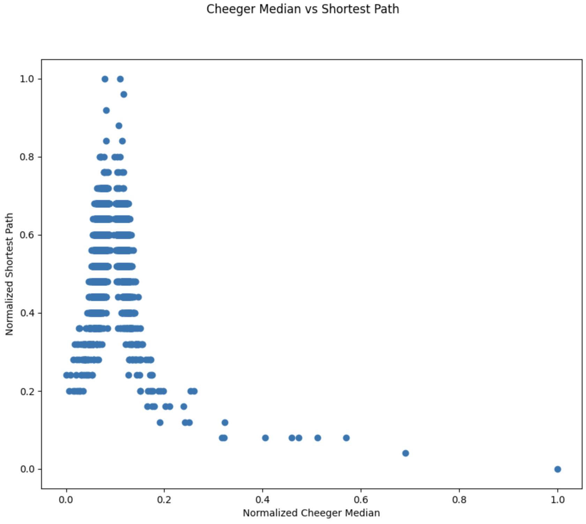
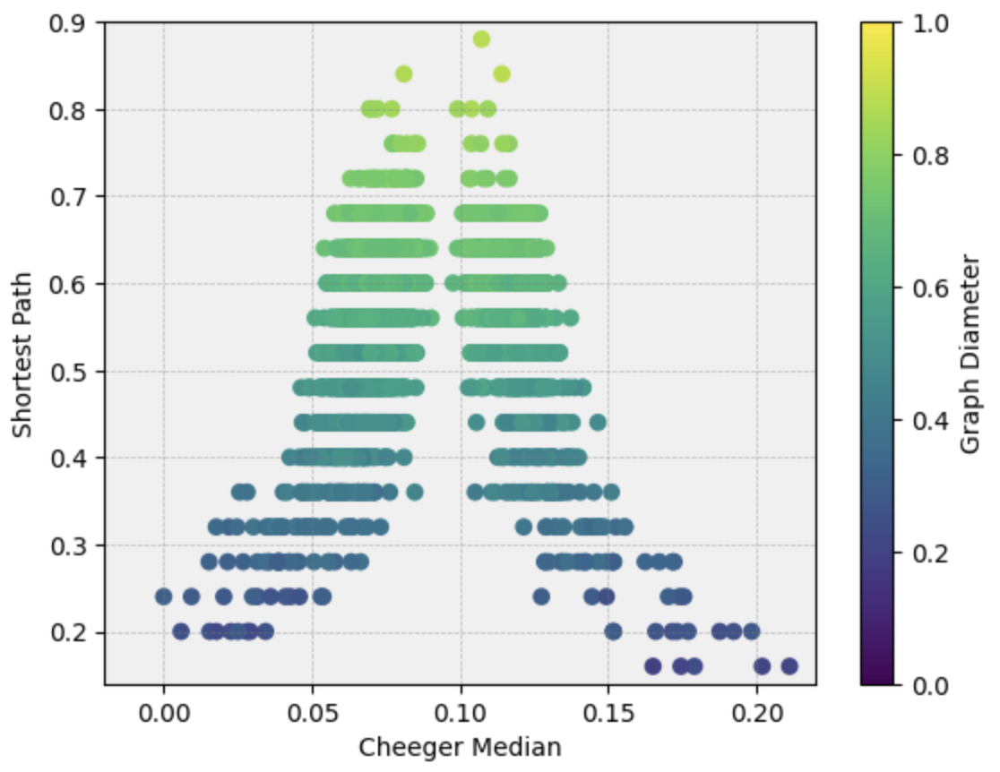

# Introduction
(some basic introduction)

(related work)

(analysis of the paper and its key components)
Message-passing graph neural networks (MP-GNNs) work by aggregating information locally within the neighborhoods of each node. This approach is powerful, but it suffers from a number of shortcomings in “long range interaction” (LRI) tasks, which require combining information from distant nodes. The paper [[1]](#1) introduces Long Range Graph Benchmark - with five graph datasets -  PascalVOC-SP, COCO-SP, PCQM-Contact, Peptides-func and Peptides-struct. PascalVOC-SP and COCO-SP are node classification datasets extracted from image datasets.  PCQM-Contact, Peptides-func and Peptides-struct are molecular datasets aimed at predicting properties of molecules or classifying them.   According to the paper, these datasets possess properties to model long range interactions by various graph learning tasks. These properties are huerestically defined in the paper, such as graph size, the nature of graph learning task and the contribution of global graph structure to the task. Along with introducing the datasets, the authors present baseline benchmarking results on the long range graph tasks using GNN and Graph Transformers. 

# Motivation
( weaknesses/strengths/potential which triggered your group to come up with a response.)

# Contribution
(some intro line about motivation....)

We summarise our main contributions as follows:
1. We apply curvature-based rewiring method -  Stochastic Discrete Ricci Flow (SDRF) algorithm to Pascal SP [[2]](#2). As shown in [Figure 2](#fig2), we rewire the graph and pass it through trained graph models. The aim is to analyse whether rewiring helps to mitigate the problem of oversquashing.  
2. Pascal-SP dataset has node embedding of size 14 where the first 12 features are related to the color of the node and the last 2 features are related to its x,y position. We separate the feature embedding into node embedding and coordinate embedding, to incorporate type-0 representations (i.e. relative distances between the nodes). We do this, inorder to see whether considering geometrical representations of the nodes can help with oversquashing. We implement E(n)-invariant and E(n)-equivariant graph networks [[3]](#3) to see whether these 2 variants of translation equivariance architectures help to handle oversquashing. 
3. To handle the issue of oversmoothing where the values of hidden node converge in deeper layers, we apply some of the "jumping techniques" introduced in [[4]](#4).  Specifically, we apply concatenation and max pooling of all the layers in every forward pass. 
4. We measure the sensitivity of node x to node y, or the influence of y on x, by measuring how much a change in the input feature of y affects the representation of x in the last layer. This helps us to see how for different models, the influences over short and long graph distances change. We implement the definition of this influence score introduced in Section 3, Definition 3.1 of [[4]](#4).
5. We analyse the usage of the Cheeger constant [[2]](#2) and minimal average path as "measurements of LRI" in the graph by attempting to find a correlation between the values of these metrics and the level of influence of long-range interactions on different models' prediction.
We predict that high Cheeger values would correlate with high bottleneck and high average shortest path would correlate with the range of interactions. As the oversquashing problem relates to an interaction between bottlenecking and distance, we predict that models that should perform better under LRI tasks would specifically perform better on
graphs with high values on both of these metrics.
6. Finally advanced  models like Steerable GNN [[5]](#5) have been used mostly in toy datasets like N-body and QM9. We experiment this with Pascal-SP to verify whether steerable messages improve upon the above mentioned trivial equivariant graph networks that send invariant messages. Ideally we expect this message passing approach, should be maximally expressive due to E(3) equivariance. (This is an ongoing Work)

|     |  | 
| -------- | -------- |
| Figure 1: E(n)-Invariant and E(n)-Equivariant Architecture    | Figure 2: Rewiring Inference Architecture  |  
  
  |  |  |  |
 | -------------------------------------------|-------------------------------|-----------------------------------------------------------|
 | Figure 3: Cheeger value against average shortest path | Figure 4: heat map of graph diameter against Cheeger value and average shortest path | Figure 5: Distribution of graphs across the 3 metrics |
# Results

Applying SDRF rewiring to the graphs of Pascal dataset and then training the Transformer+LapPE model gives an improved performance as shown in the table below. We are working on applying the same for other models.

| No. of edge additions | Best test F1 |
| ------------------- | ------------ |
| 0 (original graphs) | 0.261        |
| 10                  | 0.2757       |
| 20                  | 0.2635       |

We see an increase in f1 scores on adding 10 edges to every graph, but we also see a decrease in score on adding 20 edges. It would be interesting to experiment with the amount of edges being added and the effect it has on f1 scores to reach an appropriate threshold after which rewiring becomes detrimental (ongoing work).

In the table below, we present the F1 scores for the models we trained. Here JK1 denotes the jumping knowledge variant 1 where we concatenate hidden outputs of all layers. And JK2 denotes the jumping knowledge variant where we do maximum pooling of all the layers.

| Model                   | # Params  | Best train F1  | Best val F1 | Best test F1 |
|-------------------------|-----------|----------------|-------------|--------------|
| GCN                     | 496k      | 0.46046        | 0.15339     | 0.1585       |
| E(n)-Invariant          | 523k      | 0.44664        | 0.21416     | 0.2213       |
| E(n)-Invariant (JK 1)   | 572k      | 0.38194        | 0.22385     | 0.23597      |
| E(n)-Invariant (JK 2)   | 523k      | 0.51587        | 0.23583     | 0.23675      |
| E(n)-Equivariant        | 523k      | 0.3767         | 0.2434      | 0.2516       |
| E(n)-Equivariant (JK 1) |           |                |             |              |
| E(n)-Equivariant (JK 2) | 523k      | 0.4613         | 0.2399      | 0.2453       |
| Transformer+LapPE       | 501k      | 0.8062         | 0.2624      | 0.2610       |

(influence score dist)

We use [Figure 3](#fig3) to select a few graphs from the datasets
to plot and observe whether they suffer from long range interactions and bottlenecks.
We would generate a heat map similar to [Figure 4](#fig4) with accuracies instead of diameter per model
in order to observe the relation between the metrics and the model behaviors.
# Conclusion

# References
<a id="1">[1]</a> 
Dwivedi, Vijay Prakash et al. “Long Range Graph Benchmark.” ArXiv abs/2206.08164 (2022): n. pag.

<a id="2">[2]</a> 
Topping, Jake et al. “Understanding over-squashing and bottlenecks on graphs via curvature.” ArXiv abs/2111.14522 (2021): n. pag.

<a id="3">[3]</a>
Satorras, Victor Garcia et al. “E(n) Equivariant Graph Neural Networks.” International Conference on Machine Learning (2021).

<a id="4">[4]</a>
Xu, Keyulu et al. “Representation Learning on Graphs with Jumping Knowledge Networks.” International Conference on Machine Learning (2018).

<a id="5">[5]</a>
Brandstetter et al. "Geometric And Physical Quantities Improve E(3) Equivariant Message Passing"

