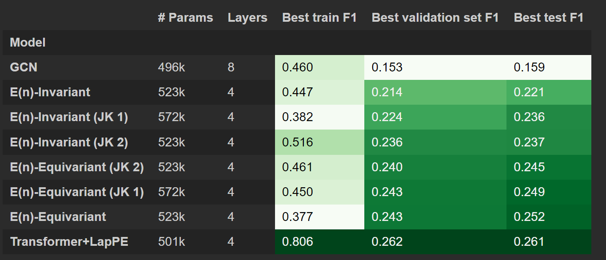
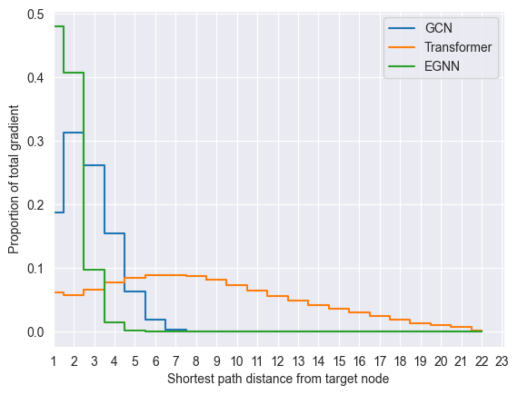
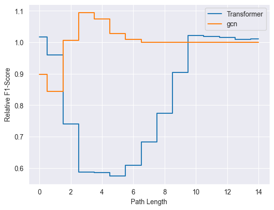

# 1. Introduction

## 1.1 Graph Neural Networks

A great number of systems in different branches of science can be described as sets, and relationships between the members of a set. For example, molecules are sets of atoms, which are related by their bonds; images are sets of pixels that are related by their relative positions. 

It's common to describe such systems mathematically as a 'graph'. Formally, a graph G is a pair of sets $(V, E)$ such that $E = {(v_i, v_j) | v_i, v_j \in V}. $V$ is referred to as the vertices or nodes, and $E$ is referred to as the edges. The 'neighbours' of a node $v \in V$ are the set of nodes that are connected to $v$ by an edge. Because this structure is so common, there has been considerable interest in designing neural network architectures that can perform inference effectively on graphs. 

Many neural networks that operate on graphs work within the ‘message passing’ paradigm, where each layer of the network is responsible for aggregating ‘messages’ - functions of the node features - that are passed from a node to its neighbours [[13]](#13). Adding depth to the network allows information from more distant nodes to be combined, as each subsequent layer allows information to be passed one edge further than the previous one. This approach is a powerful one: by designing the network to process only local neighbourhoods, we allow weight sharing between all neighborhoods and allow the networks to process graphs with arbitrary sizes and topologies. However, this focus on local information can make it difficult to apply the Message Passing framework when interactions between distant nodes are important. We describe such datasets as exhibiting ‘long range interaction’ (LRI).  Recent work has shown the message passing paradigm can fail in some surprising ways on LRI problems.

First, it's clear that message passing neural networks (MPNNs) may 'under-reach' if there aren't enough layers to allow important information to be combined from distant nodes.  

Second, [[7]](#7) identified ‘over-smoothing’, where adding too many layers to a MPNN can cause nearby nodes to have indistinguishable hidden features in the later layers of the network. This occurs because each convolution blurs together the features within a neighbourhood. This is especially an issue in the LRI  case, because a large number of layers is required for messages to reach between nodes that are far apart.

Third, [[12]](#12) identified ‘over-squashing’, where the graph topology induces bottlenecks that prevent the flow of information between different parts of the graph. Because each message in an MPNN has a fixed capacity, nodes with many neighbours may not be able to pass on all the useful information that they have access to. LRI tasks should therefore be harder to solve in topologies that have strict bottlenecks, because essential information is more likely to be lost while passing from node to node.

In the rest of the text, we refer to these three phenomena as the 'factors' that characterise the LRI problem.

## 1.3 The Long Range Graph Benchmark

Many of the papers that propose methods in the LRI space have tested their approach on toy datasets - while this is useful, it can give an unrealistic depiction of the weaknesses of new approaches. Furthermore, many existing benchmark graph datasets are best solved by shallow MPNNs that only consider local information, and so will not benefit from even the most well-founded LRI methods [[1]](#1). 

The Long Range Graph Benchmark [[1]](#1) are a number of datasets that attempt to provide a common framework for testing and benchmarking new LRI methods. Putatively, these are real world datasets with tasks that can only be solved by successfully solving the LRI problem, and so provide an effective test of any new LRI method. There are five datasets in total - we will describe each of these briefly below.

1. __PascalVOC-SP__: This dataset was derived from the Pascal 2011 image dataset [[8]](#8), which has class labels associated to every pixel. Each image was segmented into superpixels, and the task is to predict the class of the pixel that was originally at the centroid of each pixel. A graph is formed where the nodes correspond to each superpixel, the node features are statistics RGB values within each pixel, and the edges correspond to which superpixels are contiguous in the image. 
2. __COCO-SP__: this is similar to PascalVOC-SP, but was derived from the MS COCO dataset [[9]](#9).
3. __PCQM-Contact__: This dataset was derived from the PCQM4M [[10]](#10) molecular dataset, where each node is an atom, and the edges correspond to the molecular structure. The task is to predict pairs of nodes that will be less than 3.5 angstroms apart in the final configuration of the molecule. To ensure that only ‘long-range’ predictions are counted, the task is limited to pairs of molecules that are separated by at least 5 hops.
4. __Peptides-func__ and __Peptides-struct__: these are derived from the SATPdb [[11]](#11) dataset of peptides, a class of molecules that is characterised by a large number of nodes and complex structure. While typical peptide datasets use nodes to represent amino acids, the authors instead split these into multiple nodes, each representing individual atoms. In doing so, they imposed extra separation between the graphs. Then they defined two tasks, one a graph-level regression, one a graph-level classification, to predict molecular properties of the graph.

## Are these truly ‘long range’ benchmarks?

The central claim of the paper is that the above datasets provide a benchmark for assessing whether a new method solves the LRI problem. While the paper doesn't explicitly describe what makes for a good benchmark, we believe the datasets should satisfy these criteria:
1. At least one of the three factors that we described as characterising LRI, under-reaching, over-smoothing and over-squashing, should be present in the dataset.
2. The majority of improvements in model performance on the benchmark should come from solving one of the above problems.

In this section, we describe the arguments that the authors make in support of their claim, and discuss their strengths and weaknesses.
 

### LRI by Construction

The authors argue that they construct their datasets in such a way that acheiving good performance on them requires solving the LRI problem. In one cases, this is convincing: the PCQM contact dataset only considers interactions between distant nodes, and so cannot be solved by local information alone.

In the other cases, the justification is murkier. For example, they argue that classifying superpixels in the COCO and Pascal datasets is inherently long range, but they provide no argument for why this is the case.

Similarly, they argue that because 3D folding structure is important in determining peptide properties, and because 3D structures are determined by the interactions of multiple nodes, the peptides tasks are inherently LRI. However, it's not clear whether how this dependence on 3D geometry can be understood in terms of over-squashing and over-smoothing, which have only been characterised as dependent on the graph topology.

In summary, there isn't a strong _a priori_ reason to believe that any of the datasets are characterised by LRI, except for PCQM.

### Relative outperformance of transformer methods

'Transformer' architectures are a type of graph neural network which ignore the original input graph in favour of a fully connected one. Doing so allows them to sidestep each of the issues that characterise LRI problems. Since pairwise interactions are modelled between all nodes, there is no danger of under-reaching. Additionally, this also means we aren't compelled to include as many message passing layers, preventing over-smoothing. Finally, since there is a direct path between any pair of nodes in a fully connected graph, no other node can serve as a bottleneck, preventing over-smoothing. We will sometimes refer to GNNs that aren't transformers as 'local' methods.

The authors showed that transformer architectures with Laplacian positional encodings outperformed all other methods in 4 out of the 5 datasets. While they interpreted this as evidence of LRI in the data, there are other plausible explanations. For example, it’s possible that the extra expressivity afforded by the transformers attention mechanism was responsible for the improved performance.

Arguably, we should look for more direct evidence that improved performance was due to an ability to leverage long range information.

### Graph statistics
The authors generated statistics characterising the graphs found in each dataset, such as the graph diameter, the average shortest path, and the number of nodes. They claimed that high values of these statistics indicated LRI within the graph. However, it’s not clear whether these statistics actually capture features of the graph topology relevant to the LRI problem. A graph may have a large number of nodes, and a complex topology, but it doesn't follow that a task defined on that graph can only be solved by modelling global interactions. For example, consider the case where our task is to calculate the sum of the hidden features in nodes - this isn't dependent on graph topology.

Therefore, we think these graph statistics need to be more directly linked with model performance before we can conclude that they are proof of LRI in the datasets.

### Our Paper

Our project attempted to address the weaknesses we identified each of the above arguments. Our ultimate goals were:

1. To replicate the results of the original study. 
2. to give our reader greater confidence that these datasets are a suitable benchmark for LRI methods, in the sense that improvements on these benchmarks can be attributed to an increased ability to solve the LRI problem.
3. to provide a better characterisation of which of the three LRI factors were most important.

Because we had limited computational resources, we chose to focus on the Pascal dataset. Because this is a node classification dataset, it allows us to investigate long range interactions in ways that are impossible for graph level tasks.

# 3. Experiments

### 3.1 Which models perform best on the Pascal Dataset?

We began by training a number of models on the Pascal VOC dataset. This both replicated the original models, and gave us access to a set of models that we could use to test hypotheses about the presence of LRI in the dataset. 

For a uniform comparison of performance across models, we follow the convention of limiting the number of parameters to approximately 500k. We also deviate from the original paper in using a cosine learning rate scheduler rather than the default 'reduce on plateau' scheduler, because we faced compatibility issues when using the latter. This does not affect our results substantively, but accounts for minor differences between our results and the original paper.

As with the original study, we found that a transformer architecture performed better than all other models. However, we also tested a variety of MPNN models that explicitly encoded geometric information. We felt that these were a 'fairer' test of the capacity of a message passing network, because the geometric relationship between two nodes is more semantically meaningful than the one imposed by the arbitrary topology of the superpixel boundary graph. We found that these models gave comparable performance  to the transformer, even with as few as two message passing layers.

A brief description of the models, and their performance, is given below:

Recall that our second goal above was to see whether improvements on the LRGB were caused by an improved ability to model long range interactions. From this point of view, these results are worrisome, because we found that a model that could only use local information - which is by definition not capable of modelling LRI - was nearly as performant as one that could model interactions between all nodes.

TODO more discussion of the JK models? These are interesting because they are explicitly done to help oversmoothing.

### 3.2 Is performance correlated with increased importance of distant nodes?

If the Pascal dataset was truly characterised by LRI, we should expect two things:
- for models that treat distant nodes the same way as nearby ones (like transformers), we expect that the features of those distant nodes are important to the accuracy of their predictions.
- for local architectures with $L$ total layers, we expect that the importance of nodes should be roughly equal for all nodes that are less than or equal $L$, and 0 after that.

To test these hypotheses, we used __influence functions__ (REF) to quantify the importance of nodes at different distances from each target node. Briefly, if we let $h_v^{(0)}$ be the input features associated with node $v$, and we let $y_u^{(i)}$ be the $i$th logit calculated during the classification of node $u$, then the influence of $v$ on $u$ is calculated as:

__#TODO__ - Madhura/Avik can you guys double check I have this right?

$$ | \frac{\delta \sum_i y_u^{(i)}{\delta }  | h_v^{(0)} | $$

Where the individual gradients are obtained empirically through the Pytorch autograd system.

To ensure that we could compare influence scores between models, we normalised the scores for each target node across all other nodes. That is, letting $I(u, v)$ be the influence of $v$ on node $u$, we computed the normalised influence score as:

$$ \tilde{I}(u, v) = \frac{I(u, v)}{\sum_i I(u, v_i)} $$

The results of this analysis are shown below. The x-axis shows various path lengths, and the y-axis shows the normalised influence scores, averaged across all choices of target node for all graphs in the dataset.

We found that transformers do see a greater influence from distant nodes than local architectures. Surprisingly, we 

### 3.3 Are distant nodes important for achieving good accuracy?

While the above analysis shows that the predictions of our transformer are affected by distant nodes, it does not necessarily follow that _accurate_ predictions depend on the information in those nodes. Note that in section 3.1, the transformer had a very large gap in performance between the train and test data compared to the other models. Therefore, it's possible that the transformer was simply over-fitting to distant nodes, and they are unimportant when generalising to the test set.

To test this hypothesis explicitly, we tested how the accuracy of our models changed when we replaced the input features at a specific distance (as measured by shortest path) from the target node with the mean input features of the dataset. This corresponds to evaluating the accuracy of the _expected_ prediction when only a subset of the information is known. That is, let $x_d$ denote all the input features, at distance $d \in \{ 1, ... D \}$ from the target node. Also, denote $ x_{\bar{d}} = { x_i, i \neq d}$. Then we measure the accuracy of the model $f_d(x)$ given by:

$$ f_{d}(x) =  E_{X_1, ..., X_D}[f(x) | X_{\bar{d}}] $$
$$= E_{X_d |X_{\bar{d}}}  ..., X_D}[f(x)] $$
$$ \approx E_{X_d}[f(x)] \approx f(x_{\bar{d}}, E_{X_d}) $$

Where the last two steps assume the input features are independent, and that the model is locally linear. The argument was inspired by [14].
Therefore, if there is useful information in distant nodes, we expect to see a large drop in accuracy when we replace the features of those nodes. 

The results are reported below, where the y-axis shows either the accuracy or macro-weighted f1 score as a proportion of what is obtained when the original input features are used.

There are a number of interesting observations from this graph:
* The transformer does leverage distant nodes more effectively than the GCN, even at distances that the GCN can 'reach'. This may indicate that the GCN is suffering from over-squashing, although it is not conclusive.
* There appears to be no useful information beyond path lengths of ~8, even for transformers.
* For both the GCN and the transformer, there is a mismatch between the maximum distance at which we obtain significant influence scores, and the maximum distance that affects accuracy. This indicates that at least some of the observed influence of distant nodes is 'spurious' in that it affects the model's predictions without increasing accuracy.

### 3.4 Does model performance correlate with graph qualities that predict over-squashing?

Recall that the original LRGB paper claimed that their datasets were good benchmarks for LRI based on three statistics of the graphs they contained: the average shortest path distance between nodes in the graph, the graph diameter, and the number of nodes. 

We hypothesised that if these statistics were indicative of the presence of long range interactions in the dataset, then we would be able to correlate them with the relative performance of different models. For example, because transformers are less susceptible to over-squashing than GCNs, we expected that they should outperform GCNs on tasks with high values of each statistic.

While it's not clear that the statistics we mentioned are related to over-squashing, we also investigated an alternative statistic that has a stronger theoretical relationship with over-squashing.

Recently [2] has shown that the degree of over-squashing can be measured by spectral properties of a graph. The Cheeger constant $h_G$ of a graph G is defined as:

$$h_G = \min_{S \subseteq G} h_S \text{  where  }  h_S = \frac{|\delta S |}{\min vol(S), vol(V/S)}$$

where the _boundary_  $|\delta S |$ is defined as the set of edges 'leaving S' $\delta S = \{ (i, j) : i \in S, j \not\in S}$ and the _volume_ $vol(S) = \sum_{i \in S} \text{degree}(i)$. In other words, the Cheeger constant is small when we can find two large sets of vertices with empty intersection, $S$ and $V\S$, such that there are few edges going between them. In other words, there is a bottleneck between the two sets.

[2] showed that $2h_G$ is an upper bound for the minimum 'balanced Forman curvature' of the graph, a quantity that describes how 'bottlenecked' the neighbourhood of each edge in the graph is in terms of the number of cycles it appears. The definition is too lengthy to reproduce here, but negative values for a given edge $(i,j)$ can be interpreted as indicating that this edge forms a 'bridge'  between two sets of vertices.

In turn, this curvature controls how effectively gradients can populate through each neighbourhood of the graph (one possible definition of oversquashing). Finally, although the Cheeger value is infeasible to compute exactly, the first eigenvalue $\lambda_1$ of the graph Laplacian is a strict upper bound for $2 h_G$. 

In summary, we expect that graphs with low Cheeger values should suffer more from over-squashing.

#### Results

### 3.5 Qualitative investigation of graph characteristics 

### 3.6 Does rewiring the graph to remove bottlenecks improve performance?

Plan:
* can prove that oversquashing is a problem based on the application of a problem that is designed to fix oversquashing.

## 4. Conclusions

The goals of this study were to replicate the results of the original study, to provide a better characterisation of which of the three LRI factors were most important and finally to assess whether the LRGB was indeed a good benchmark for LRI. The first of these was met unequivocally, whereas the other two deserve more qualified discussion.

### 4.1 Which LRI factors are most prevalent?
The only LRI factor we found unequivocal evidence for was 'under-reaching'.We showed that the predictions of transformer models were heavily influenced by distant nodes. Moreover, we showed that distant nodes (up to 8 nodes away) had a meaningful influence on the accuracy of those predictions. This shows that our method can be used to place a lower bound on the length of interaction on a candidate LRI dataset, although this is only possible on node-level tasks.

We found little evidence for over-squashing in the Pascal dataset. If this had been present, we expected that we would find a relationship between the Cheeger constant and the relative accuracies of the transformer and GCN. Moreover, our qualitative exploration of the datastet made us doubt that over-squashing could be meaningfully captured by any simple topological statistics.

### 4.2 Is the LRGB a good benchmark?

We can give a qualified yes: it's true that there is useful information in distant nodes, and a model can improve its performance on this dataset by leveraging that information. However, there are two important caveats: the first is that a model can drastically improve its performance even while only focussing on local information. Therefore, we recommend applying the method from section 3.3 to quantify the impact of nodes at different distances before linking increased accuracy to improved modelling of LRI. The second is that we have seen no evidence to believe that over-squashing is an issue in these datasets.

# 5. Individual Contributions

*__Nik__ performed the experiments relating shortest path distance to influence, F1-score and accuracy (although he relied on Madhura and Avik to implement the jacobian for the influence score), assisted in writing the code for the Cheeger value experiments, and wrote most of the blogpost.

# 6. References
<a id="1">[1]</a> 
Dwivedi, Vijay Prakash et al. “Long Range Graph Benchmark.” ArXiv abs/2206.08164 (2022): n. pag.

<a id="2">[2]</a> 
Topping, Jake et al. “Understanding over-squashing and bottlenecks on graphs via curvature.” ArXiv abs/2111.14522 (2021): n. pag.

<a id="3">[3]</a>
Satorras, Victor Garcia et al. “E(n) Equivariant Graph Neural Networks.” International Conference on Machine Learning (2021).

<a id="4">[4]</a>
Xu, Keyulu et al. “Representation Learning on Graphs with Jumping Knowledge Networks.” International Conference on Machine Learning (2018).

<a id="5">[5]</a>
Brandstetter et al. "Geometric And Physical Quantities Improve E(3) Equivariant Message Passing"

<a id="6">[6]</a>
Ravi Montenegro and Prasad Tetali "Mathematical Aspects of Mixing Times in Markov Chains"

<a id="7">[7]</a>
Li, Qimai et al. “Deeper Insights into Graph Convolutional Networks for Semi-Supervised Learning.” AAAI Conference on Artificial Intelligence (2018).

<a id="8">[8]</a>
Everingham, Mark et al. “The Visual Object Classes (VOC) Challenge.” International Journal of Computer Vision 88 (2010): 303-338.

<a id="9">[9]</a>
Lin, Tsung-Yi et al. “Microsoft COCO: Common Objects in Context.” European Conference on Computer Vision (2014).

<a id="10">[10]</a>
Hu, Weihua et al. “OGB-LSC: A Large-Scale Challenge for Machine Learning on Graphs.” ArXiv abs/2103.09430 (2021): n. pag.

<a id="11">[11]</a>
Singh, Sandeep et al. “SATPdb: a database of structurally annotated therapeutic peptides.” Nucleic Acids Research 44 (2015): D1119 - D1126.

<a id="12">[12]</a>
Alon, Uri, and Eran Yahav. "On the bottleneck of graph neural networks and its practical implications." arXiv preprint arXiv:2006.05205 (2020).

<a id="13">[13]</a>
Bronstein, Michael M., et al. "Geometric deep learning: Grids, groups, graphs, geodesics, and gauges." arXiv preprint arXiv:2104.13478 (2021).

<a id="14">[14]</a>
Lundberg, S. M., & Lee, S. I. (2017). A unified approach to interpreting model predictions. Advances in neural information processing systems, 30.